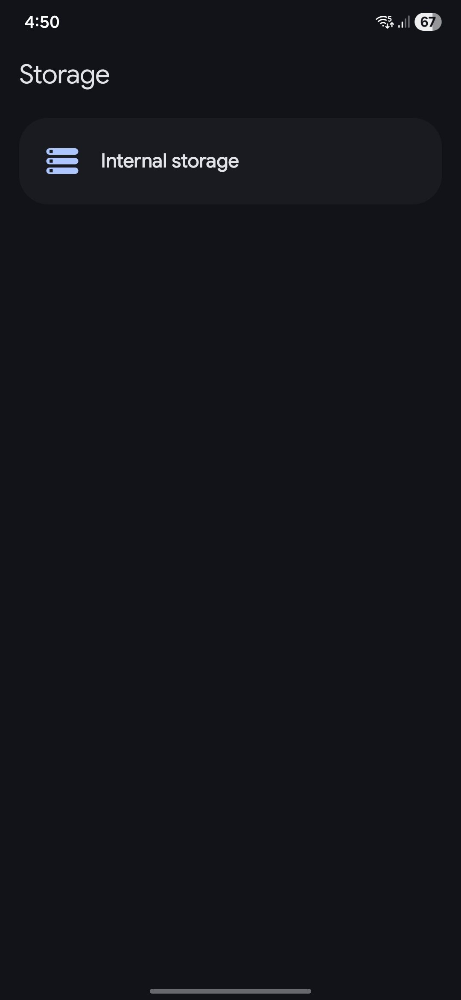
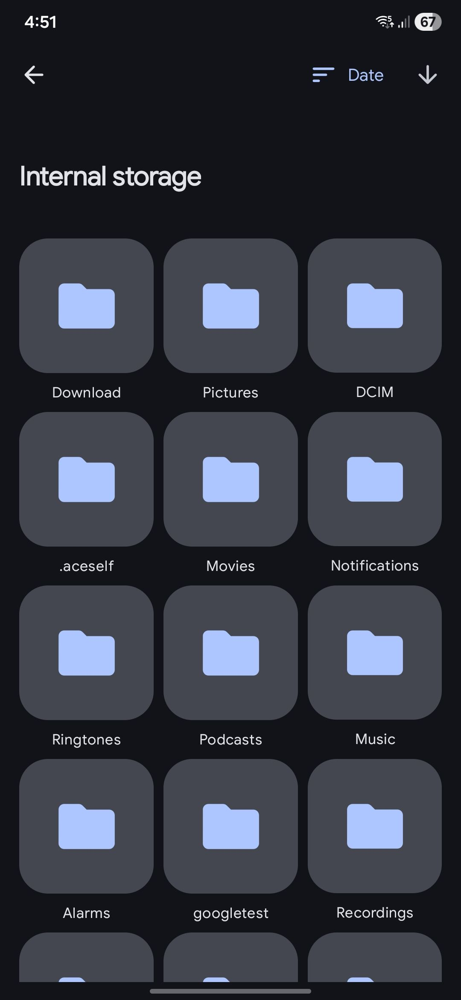
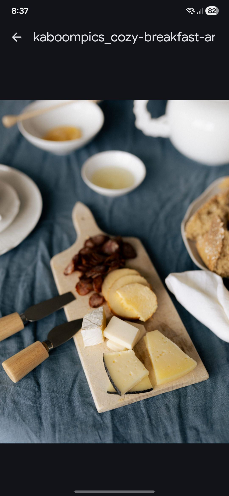
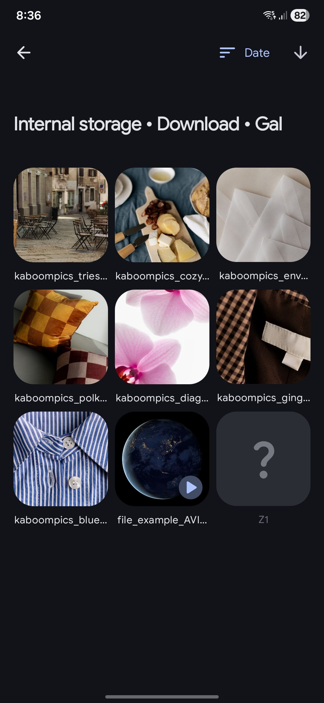
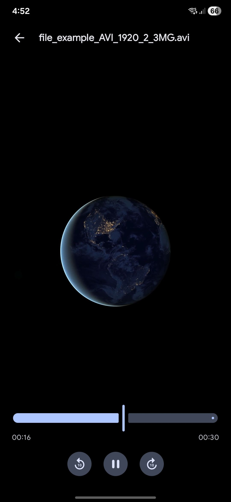

# Gallery Explorer

Gallery Explorer is a media-only Android file explorer focused on images and video. The app is built with Kotlin,
Jetpack Compose, Hilt, Voyager, Room, DataStore, and Media3, and its core viewer experience allows vertical swiping
between files of the same type without bouncing back to the folder view.

This repository contains a single Android module, `:app`, and follows a strict MVI + Voyager architecture with shared
code split across `core/domain`, `core/framework`, `core/data`, and `core/presentation`.

## What The App Does

* Browses mounted storage volumes from a home screen.
* Navigates folders containing images and videos.
* Opens immersive image and video viewers.
* Supports TikTok-like vertical paging between sibling media items.
* Handles removable storage changes and playback restoration.
* Excludes audio-only files by design.

## Screenshots

| Home                            | Explorer                                                  | Viewer                                            |
|---------------------------------|-----------------------------------------------------------|---------------------------------------------------|
|  |  |  |

Additional screens:

* 
* 

## Tech Stack

* Kotlin `2.1.21`
* Android Gradle Plugin `8.9.3`
* Compose BOM `2025.12.01`
* Material 3
* Hilt
* Voyager `1.1.0-beta03`
* Coroutines and Flow
* Room `2.7.2`
* DataStore Preferences
* Media3 `1.8.0`
* Detekt + Ktlint formatting rules
* JUnit 4, MockK, Turbine, Kluent, Robolectric, Konsist, Kover

## Requirements

* Android Studio with Android SDK 35 installed.
* JDK 17.
* An Android 11+ device or emulator, because the app targets `minSdk 30`.
* A test device/emulator with some sample images or videos available in storage.

## First-Time Setup

1. Clone the repository.
2. Open the project root in Android Studio.
3. Let Gradle sync and download dependencies from `google()` and `mavenCentral()`.
4. Confirm the IDE is using JDK 17.
5. Run the `app` configuration on a device or emulator with API 30+.
6. Grant the app's file-management permission when prompted.
7. Make sure the device has pictures or videos to browse, otherwise the UI will look empty even when the app is working.

## Running The App

From Android Studio, run the `app` configuration as usual.

From the terminal:

```bash
./gradlew :app:installDebug
```

To build without installing:

```bash
./gradlew :app:assembleDebug
```

## Useful Commands

Run static analysis:

```bash
./gradlew :app:detekt :app:lintDebug
```

Run JVM tests:

```bash
./gradlew :app:testDebugUnitTest
```

Generate and verify coverage:

```bash
./gradlew :app:koverHtmlReportDebug :app:koverVerifyDebug
```

Build the release variant:

```bash
./gradlew :app:assembleRelease
```

Run the local CI mirror:

```bash
./scripts/run_ci_local.sh
```

The local CI script writes logs and copied artifacts to `build/local-ci-artifacts`.

## CI

GitHub Actions runs on pull requests targeting `main` and `develop`.

The workflow currently executes:

* `quality`: `:app:detekt` and `:app:lintDebug`
* `test`: `:app:testDebugUnitTest`, `:app:koverHtmlReportDebug`, `:app:koverVerifyDebug`
* `schema-check`: `:app:assembleRelease` plus a diff check on `app/schemas`
* `release-build`: `:app:assembleRelease`

Reports and build outputs are uploaded as CI artifacts.

## Project Layout

```text
.
|* app/
|  |* src/main/java/xyz/dnieln7/galleryex/
|  |  |* core/
|  |  |  |* data/
|  |  |  |* domain/
|  |  |  |* framework/
|  |  |  `* presentation/
|  |  |* di/
|  |  |* feature/
|  |  |  |* home/
|  |  |  |* explorer/
|  |  |  `* viewer/
|  |  `* main/
|  `* src/test/
|* config/detekt/
|* screenshots/
`* scripts/
```

## Architecture Notes

This project is strict about boundaries. New contributors should follow these rules immediately:

* Shared contracts, models, events, and errors used by more than one feature belong in `core/`.
* Shared domain contracts and pure models belong in `core/domain/<area>/`.
* Android or framework-backed implementations belong in `core/framework/<area>/`.
* Shared repositories and persistence code belong in `core/data/`.
* Compose helpers, UI adapters, themes, and components belong in `core/presentation/`.
* Do not colocate domain contracts, framework implementations, and Compose helpers in the same file.
* Feature presentation code must split into `presentation/screen` and `presentation/component`.
* MVI `State`, `Action`, and `Event` files live in each feature's `domain/model` package.
* The Voyager `Screen` destination is the orchestrator; the stateless screen composable is the renderer.

Current high-level feature map:

* `feature/home`: mounted storage list and access flow
* `feature/explorer`: folder navigation and file grid/listing
* `feature/viewer`: image/video viewers, playback, and restore behavior
* `main`: top-level app host and navigation root

## Coding Conventions That Matter Here

* Read [`AGENTS.md`](AGENTS.md) before making non-trivial changes.
* Keep changes narrow and repo-specific.
* Use Material 3 patterns consistently.
* Use KDoc for new public classes and functions.
* Prefer `Either<Error, T>` for repository, controller, and use-case contracts.
* Do not add wrapper functions that only forward calls without adding real value.
* Keep file-local helpers, constants, and types `private` when possible.
* Put named constants at the end of the file in `SCREAMING_SNAKE_CASE`.
* Always use trailing commas.
* Do not edit `baseline.xml` files or add Detekt suppressions unless explicitly approved.
* Do not move shared behavior into a feature package when it belongs in `core/`.

## Testing Notes

* Tests live under `app/src/test`.
* The project prefers JVM tests, with Robolectric only when Android framework access is required.
* Test names must use the `GIVEN ... WHEN ... THEN ...` pattern and backticks.
* MockK usage should default to relaxed mocks.
* Current tooling includes JUnit 4, MockK, Turbine, Kluent, Robolectric, Konsist, and coroutines test.
* Kover verification is configured in Gradle with a `20%` minimum line coverage bound for the filtered debug report.

## Design And Supporting Docs

* [`AGENTS.md`](AGENTS.md): repository rules and architecture constraints
* [`DESIGN.md`](DESIGN.md): current design system tokens and visual direction
* [`.github/workflows/ci.yml`](.github/workflows/ci.yml): pull request checks
* [`scripts/run_ci_local.sh`](scripts/run_ci_local.sh): local CI parity script

## Recommended Onboarding Path

If you are new to the codebase, this sequence is the fastest way to get oriented:

1. Read `AGENTS.md`.
2. Open `app/build.gradle.kts` to understand build, quality, Room, and coverage configuration.
3. Start from `main/presentation/screen/MainActivity.kt`.
4. Follow the navigation flow into `feature/home`, `feature/explorer`, and `feature/viewer`.
5. Run `./scripts/run_ci_local.sh` before opening a pull request.
